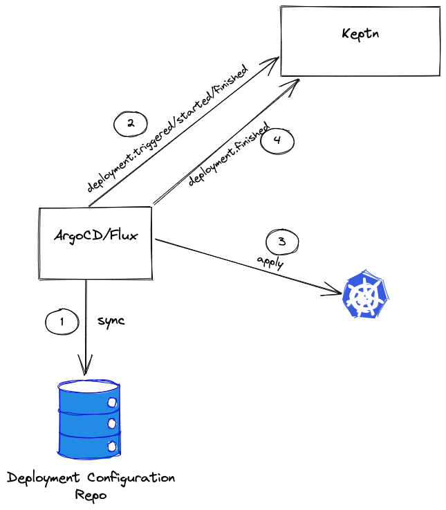

# Flux Integration for Keptn

## Motivation
As adopters of Keptn move to a GitOps paradigm in their organization it is essential that for the deployment purpose they use Argo Flux by integrating it in the [keptn/keptn](https://github.com/keptn/keptn) workflow.

As a project that is about to be incubated into the CNCF, it is even more important now to make adoption as seamless as possible. One thing which also might be stated is that many people like to use Argo/Flux and it would bring a huge benefit to the ecosystem when keptn as an orchestrator could deal with this.

## The Idea
The idea of this project was building an integration of gitops-based tools, like Flux or ArgoCD to let them interact with keptn. 

For instance, ArgoCD or Flux should be able to sync with their GitOps repositories and when they start their tasks, they should notify keptn that something started or finished, to let keptn orchestrate the rest of the process (test/quality gating, etc.).

Argo/Flux is often used in the ecosystem and it would make sense to integrate this. As the deployment workflow itself might be triggered by the GitOps Framework (not by keptn), keptn needs to get information about a triggered/started/finished deployment.

To be able to use GitOps tools in combination with keptn, the main goal of this project is to find a proper way how the tools could interact with keptn and to build an integration for such tools.

## Workflow (What / How it Happens)

So, initially, there might be some configuration of ArgoCD/Flux somewhere.
1. ArgoCD/Flux is connected to a Git Repo, which contains the deployment
manifests/helm-charts, ... and syncs with this repo.
2. When there's something new, Argo/Flux triggers the deployment and notifies
keptn about this (deployment.triggered, started event).
3. The manifests/helm charts get applied to the target cluster.
4. ArgoCD/Flux notifies keptn that everything is finished.

## Contributors

A big thanks to all [maintainers](CODEOWNERS) and [contributors](https://github.com/keptn-sandbox/keptn-flux-integration/graphs/contributors)!

## Contributing guidelines

Please refer to [Keptn contributing guidelines](https://github.com/keptn/keptn/blob/master/CONTRIBUTING.md) for a general overview of how to contribute to this repository with special attention to our [bug first policy](https://github.com/keptn/keptn/blob/master/CONTRIBUTING.md#bug-first-policy)
